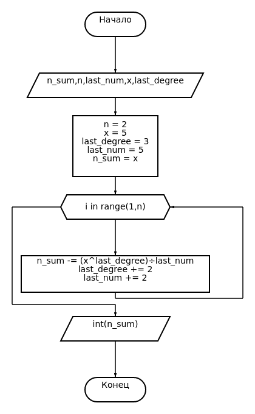

# Python2FlowChart
**Python2FlowChart** - cli инструмент для построения json-файла блок-схемы по языку python для сайта [block-diagram-redactor](https://programforyou.ru/block-diagram-redactor"block-diagram-redactor").
- автоматическое определение типа выражения
- удаление ненужных в блок-схеме конструкций
- автоматическое определение переменных
## Пример использования
### Ввод: 
```python
n = 2
x = 5
last_degree = 3
last_num = 5
n_sum = x


for i in range(1,n):
    n_sum -= (x**last_degree)/last_num
    last_degree += 2
    last_num += 2

print(int(n_sum))
```
### Вывод(на сайте)
[](example.png)
## Требования к коду
Python2FlowChart может построить блок-схему почти по любому коду, без крашей программы, но для корректного отображения следует использовать **процедурный и функциональный стили**.

Следующие правила помогут избежать неправильного отображения/крашей:
- **не использовать многострочные комментарии**
- не использовать классы
- не использовать конструкцию try
- не указывать тип аргумента функции(например, def fun(arg: int))
- использовать import только в начале программы 
## Установка / Использование
Есть 2 варианта использования:

**1. С установкой**

Скачиваем последний [релиз](https://github.com/GachiLord/Python2FlowChart/releases), сохраняем в какую-нибудь директорию.
В терминале переходим в эту папку. Далее переходим в папку Python2FlowChart/libs/PyChart. Пишем:

```
pip install -e .
```
Возвращаемся в папку с программой и пишем:
```
pip install -e .
```
Для запуска пишем:
```
py2fc путь_к_файлу
# например py2fc example.py
```

**2. Без установки**

Скачиваем последний [релиз](https://github.com/GachiLord/Python2FlowChart/releases), сохраняем в какую-нибудь директорию. Переходим в Python2FlowChart, запускаем '\_\_main\_\_.py'
